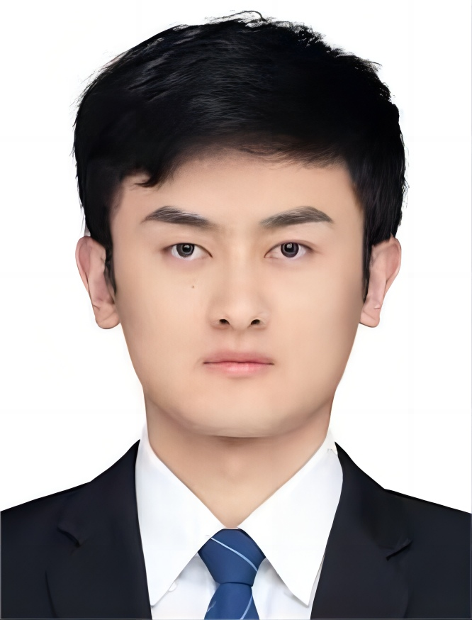

# 👋 Hello, I'm Yuanbo Wen (文渊博) !

&nbsp;&nbsp;&nbsp;&nbsp;&nbsp;&nbsp;&nbsp;&nbsp;Ph.D. Candidate

&nbsp;&nbsp;&nbsp;&nbsp;&nbsp;&nbsp;&nbsp;&nbsp;School of Information Engineering, Chang'an University

&nbsp;&nbsp;&nbsp;&nbsp;&nbsp;&nbsp;&nbsp;&nbsp;📬: [E-mail](mailto:yuanbo.wen@chd.edu.cn)

&nbsp;&nbsp;&nbsp;&nbsp;&nbsp;&nbsp;&nbsp;&nbsp;🎓: [Google Scholar](https://scholar.google.com/citations?user=8PK8tSEAAAAJ) 

&nbsp;&nbsp;&nbsp;&nbsp;&nbsp;&nbsp;&nbsp;&nbsp;🐙: [GitHub](https://github.com/chdwyb) 

***

### 👤 Biography

***

&nbsp;&nbsp;&nbsp;&nbsp;I am currently a Ph.D. candidate  in the School of Information Engineering at Chang'an University supervised by Prof. [Tao Gao (高涛)](https://js.chd.edu.cn/xxgcxy/gt100/list.htm) since September 2022. My research interests include computer vision, image restoration, deep learning, unpaired learning, object detection, intelligent transportation.

***

### ✨ News

***

- **[ Dec  10, 2024 ]**, *one* paper is accepted by AAAI Conference on Artificial Intelligence (AAAI 2025).
- **[ Oct  4, 2024 ]**, *one* paper is accepted by IEEE Transactions on Multimedia (TMM).
- **[ Sep  4, 2024 ]**, *one* co-paper is accepted by Big Data Mining and Analytics (BDMA). Congrats to Qianxi.
- **[ Jul 21, 2024 ]**, *one* paper is accepted by ACM International Conference on Multimedia (ACM MM 2024 Oral).
- **[ Jul 13, 2024 ]**, *one* paper is accepted by Information Sciences (INS).
- **[ Jun 28, 2024 ]**, *one* paper is accepted by Pattern Recognition (PR).
- **[ Jan  3, 2024 ]**, *one* co-paper is accepted by IEEE Geoscience and Remote Sensing Letters (GRSL). Congrats to Zixiang.
- **[ Dec 13, 2023 ]**, *one * co-paper is accepted by IEEE Transactions on Geoscience and Remote Sensing (TGRS). Congrats to Ziqi.
- **[ Dec 12, 2023 ]**, *one* paper is accepted by Pattern Recognition (PR).
- **[ Oct 16, 2023 ]**, *one* paper is accepted by IEEE Transactions on Geoscience and Remote Sensing (TGRS).
- **[ Jul 24, 2023 ]**, *one* paper is accepted by IEEE Transactions on Circuits and Systems for Video Technology (TCSVT).

***

### 👨‍💻 Services

***

- **Journal Reviewer**
  - IEEE Transactions on Image Processing (TIP) 
  - IEEE Transactions on Neural Networks and Learning Systems (TNNLS) 
  - IEEE Transactions on Circuits and Systems for Video Technology (TCSVT)
  - IEEE Transactions on Intelligent Transportation Systems (TITS)
  - IEEE Transactions on Geoscience and Remote Sensing (TGRS) 
  - Pattern Recognition (PR)
  - Expert Systems With Applications (ESWA) 
  - Neural Networks (NN)
  - IEEE Journal of Selected Topics in Applied Earth Observations and Remote Sensing (JSTARS)
- **Conference Reviewer**
  - International Conference on Learning Representations (ICLR 2025)
  - IEEE/CVF Conference on Computer Vision and Pattern Recognition (CVPR 2025)
  - Conference on Neural Information Processing Systems (NeurIPS 2024)
  - ACM International Conference on Multimedia (ACM MM 2024)
  - European Conference on Computer Vision (ECCV 2024)
  - IEEE International Conference on Acoustics, Speech and Signal Processing (ICASSP 2025)
  - IEEE International Conference on Multimedia and Expo (ICME 2024)
  - International Conference on Pattern Recognition (ICPR 2024)

***